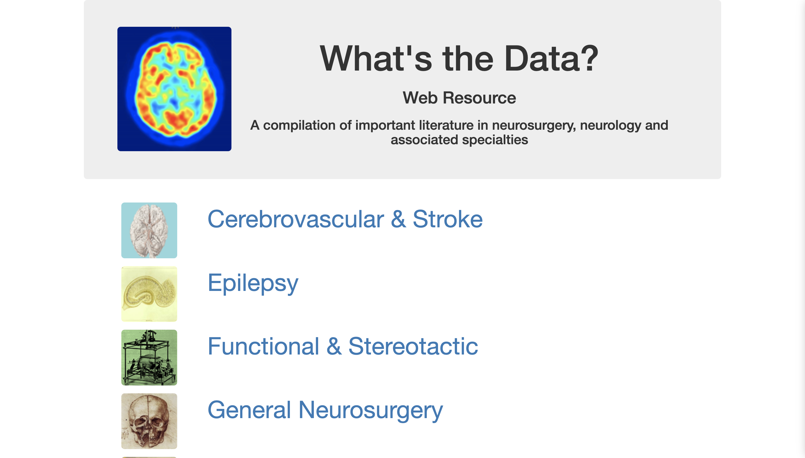
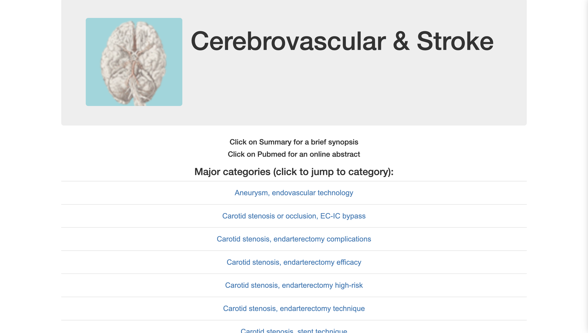

# whats-the-data

What's the Data? Is a web resource for neuroscience students to access 2000+ PubMed studies in an inutive manner. 
- HTML, Bootstrap CSS, Javascript frontend 
- AWS backend incorporating DynamoDB, S3, Lambda and API gatewat

